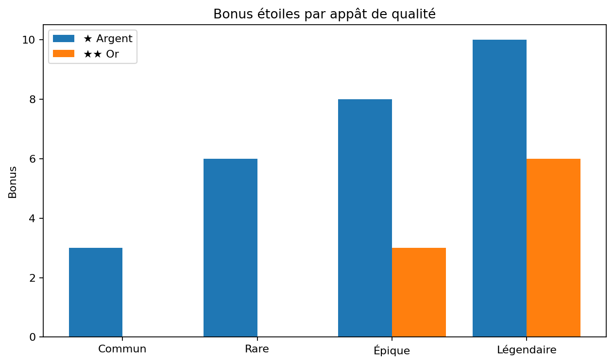
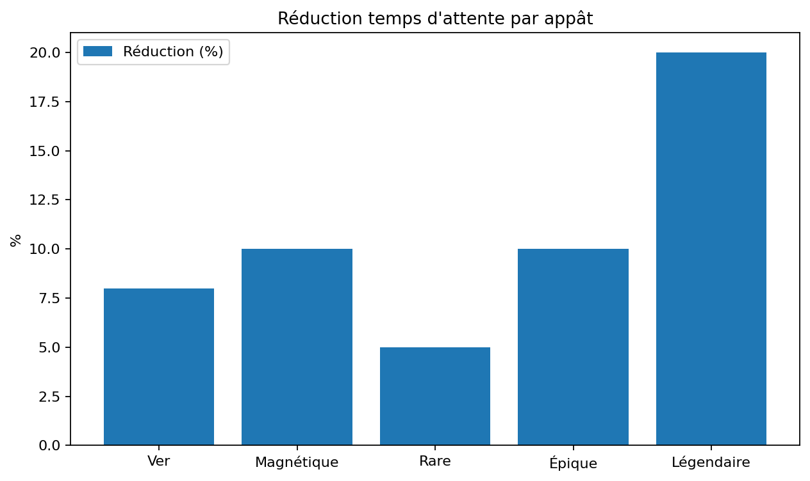

# 🎣 Appâts


Restriction : Les appâts sont interdits avec la Canne de Compétition. Tous les autres cannes acceptent les appâts.


## Tableau des appâts

| Appât | Type | Effets | Note |
| --- | --- | --- | --- |
| Appâts Simples | Basique | Difficulté -10 | Mini-jeu plus facile |
| Appâts Magnétiques | Basique | Attente ×0.90 +2s temps jeu | Pêche plus rapide |
| Appâts Sauvages | Basique | Difficulté +20 Taille ×1.5 -2s temps jeu | Gros poissons, mini-jeu difficile |
| Ver de Terre | Fishing Pack | Attente ×0.92 | Eau douce recommandé |
| Maïs | Fishing Pack | Difficulté -8 | Rivière / étang |
| Tentacule de Méduse | Fishing Pack | Océan chaud +8 | Plus d'espèces tropicales |
| Boulettes de Pâte | Fishing Pack | Taille ×1.2 | Augmente la taille des prises |
| Appât Commun | Qualité | ★ Argent +3 |  |
| Appât Rare | Qualité | ★ Argent +6 Attente ×0.95 |  |
| Appât Épique | Qualité | ★ Argent +8 ★★ Or +3 Attente ×0.90 |  |
| Appât Légendaire | Qualité | ★ Argent +10 ★★ Or +6 Attente ×0.80 Taille ×1.3 | Appât ultime |

## Graphiques

### Bonus étoiles par appât de qualité

### Réduction du temps d’attente

