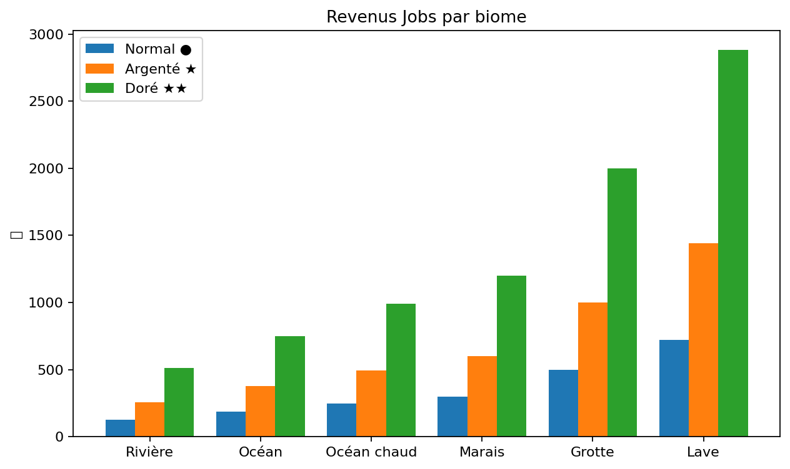
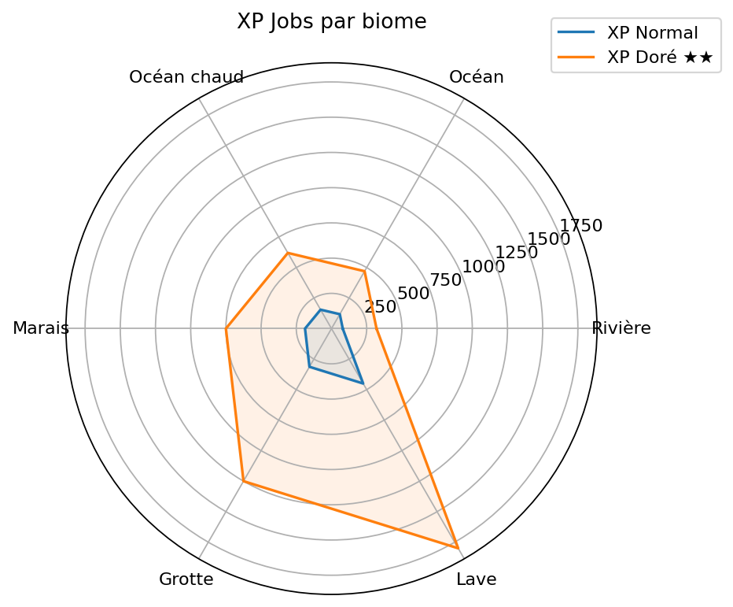

# 🎉 Gains Jobs — Métier Pêcheur


Métier : Pêcheur (niveau max 250) — Gain automatique à chaque capture via CustomFishing. Les revenus augmentent avec le niveau grâce à la progression exponentielle configurée.


## Graphiques

### Revenus Jobs par biome

### XP Jobs par biome

## Poissons Jeu de Base

| Biome | Normal ● | Argenté ⭐ | Doré ⭐⭐ | XP (Normal) | XP (★★) |
| --- | --- | --- | --- | --- | --- |
| Rivière | 128 💲 | 256 💲 | 512 💲 | 80 XP | 320 XP |
| Océan | 188 💲 | 376 💲 | 752 💲 | 118 XP | 470 XP |
| Océan chaud | 248 💲 | 496 💲 | 992 💲 | 155 XP | 620 XP |
| Marais | 300 💲 | 600 💲 | 1 200 💲 | 188 XP | 750 XP |
| Grotte | 500 💲 | 1 000 💲 | 2 000 💲 | 313 XP | 1 250 XP |
| Lave | 720 💲 | 1 440 💲 | 2 880 💲 | 450 XP | 1 800 XP |

## Poissons Fishing Pack

| Biome | Poisson | Revenu 💲 | XP | Points |
| --- | --- | --- | --- | --- |
| Rivière | Truite · Poisson Vert · Barbus Rosé · Barbus Vert | 128 | 80 | 160 |
| Poisson Bulle | 140 | 88 | 175 |  |
|  |  |  |  |  |
|  |  |  |  |  |
|  |  |  |  |  |
| Océan | Dorade · Grenadier Bleu · Thon | 188–192 | 118–120 | 235–240 |
| Anguille Bleue | 196 | 123 | 245 |  |
| Raie | 200 | 125 | 250 |  |
|  |  |  |  |  |
|  |  |  |  |  |
| Océan chaud | Crevette · Chromis · Méduse | 248–252 | 155–158 | 310–315 |
| Anthias | 256 | 160 | 320 |  |
| Étoile de Mer · Poisson Lune | 260 | 163 | 325 |  |
| Perle | 1 200 | 750 | 1 500 |  |
|  |  |  |  |  |
|  |  |  |  |  |
|  |  |  |  |  |
|  |  |  |  |  |
| Marais | Poisson Visqueux | 300 | 188 | 375 |
| Grotte | Poisson des Glaces | 600 | 375 | 750 |
| Poisson Gemme | 800 | 500 | 1 000 |  |
| Lave | Truite de Magma | 720 | 450 | 900 |
| Poisson Corail en Fusion | 760 | 475 | 950 |  |
| Poisson d'Obsidienne | 800 | 500 | 1 000 |  |
| Anthias de Lave | 840 | 525 | 1 050 |  |
| Anguille de Feu | 880 | 550 | 1 100 |  |
| Méduse Dorée | 1 600 | 1 000 | 2 000 |  |
| Vide | Poisson Bulle Cramoisi | 1 400 | 875 | 1 750 |
| Crevette Biscornue | 1 520 | 950 | 1 900 |  |

## Spéciaux

| Poisson | Revenu | XP | Points |
| --- | --- | --- | --- |
| Poisson Arc-en-Ciel | 320 | 200 | 400 |
| Coeur de la Mer | 2 000 | 1 250 | 2 500 |

## Tuer des créatures aquatiques

| Créature | Revenu | XP |
| --- | --- | --- |
| Cabillaud (Cod) | 5.6 | 3.5 |
| Saumon | 8 | 5 |
| Poisson Tropical | 10 | 6.2 |
| Poisson-globe | 10 | 6.2 |
| Calmar | 8 | 5 |
| Calmar Lumineux | 12 | 7.5 |

## Synthèse — Revenus Estimés / Heure

| Biome | Revenu Jobs /h | Revenu Sellfish /h | Total estimé /h | Difficulté d'accès |
| --- | --- | --- | --- | --- |
| Rivière | ~25 600 💲 | ~10 000 💲 | ~35 600 💲 | Facile |
| Océan | ~37 600 💲 | ~15 000 💲 | ~52 600 💲 | Facile |
| Océan chaud | ~49 600 💲 | ~20 000 💲 | ~69 600 💲 | Moyen |
| Marais | ~60 000 💲 | ~24 000 💲 | ~84 000 💲 | Moyen |
| Grotte | ~100 000 💲 | ~40 000 💲 | ~140 000 💲 | Difficile |
| Lave | ~144 000 💲 | ~58 000 💲 | ~202 000 💲 | Très difficile |
| Vide | ~290 000 💲 | ~900 000 💲 | ~1 190 000 💲 | Endgame |
