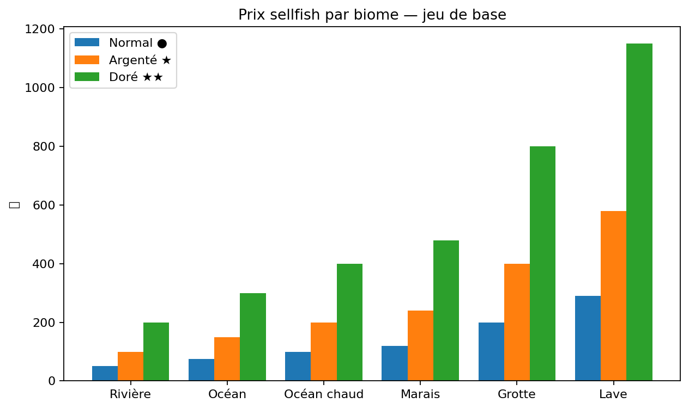
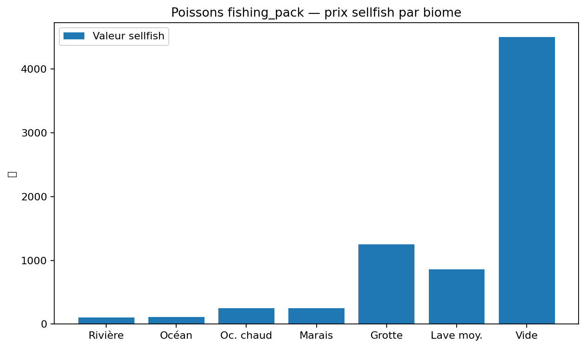

# 💲 Valeurs Sellfish


Commande : /sellfish — Vend les poissons dans l'inventaire au prix configuré. Les variantes étoiles valent ×2 (argenté) et ×4 (doré) par rapport au normal.



Limite quotidienne : Maximum 100 000 :moneyicon: de gains par jour via le marché aux poissons. Au-delà de cette limite, les ventes sont refusées jusqu'à la réinitialisation journalière.


## Graphiques

### Prix sellfish par biome — jeu de base

### Poissons fishing_pack — prix sellfish par biome

## Poissons Jeu de Base

| Biome | Espèces | Normal ● | Argenté ⭐ | Doré ⭐⭐ |
| --- | --- | --- | --- | --- |
| Rivière | Poisson Rouge · Perche · Mulet · Carpe · Poisson-chat | 50 💲 | 100 💲 | 200 💲 |
| Océan | Thon · Brochet · Sardine · Pieuvre · Poisson Lune · Vivaneau | 75 💲 | 150 💲 | 300 💲 |
| Océan chaud | Méduse Bleue · Méduse Rose | 100 💲 | 200 💲 | 400 💲 |
| Marais | Bois-Sauteur | 120 💲 | 240 💲 | 480 💲 |
| Grotte | Esturgeon | 200 💲 | 400 💲 | 800 💲 |
| Lave | Saumon du Vide | 290 💲 | 580 💲 | 1 150 💲 |

## Poissons Fishing Pack (normal uniquement)

| Biome | Poisson | Prix | Bonus taille (par cm) |
| --- | --- | --- | --- |
| Rivière | Truite · Poisson Vert · Barbus Rosé · Barbus Vert | 100 💲 | +3–6/cm |
| Poisson Bulle | 110 💲 | +12/cm |  |
|  |  |  |  |
|  |  |  |  |
|  |  |  |  |
| Océan | Dorade | 100 💲 | +3/cm |
| Grenadier Bleu | 110 💲 | +2/cm |  |
| Thon | 115 💲 | +2/cm |  |
| Anguille Bleue | 120 💲 | +2/cm |  |
| Raie | 130 💲 | +1/cm |  |
| Océan chaud | Crevette | 180 💲 | +18/cm |
| Méduse | 200 💲 | +15/cm |  |
| Poisson Corail | 200 💲 | +10/cm |  |
| Chromis | 190 💲 | +12/cm |  |
| Anthias | 210 💲 | +8/cm |  |
| Étoile de Mer | 220 💲 | +10/cm |  |
| Poisson Lune | 250 💲 | +2/cm |  |
| Perle | 2 000 💲 | +500/cm |  |
| Marais | Poisson Visqueux | 250 💲 | +10/cm |
| Grotte | Poisson des Glaces | 1 000 💲 | +40/cm |
| Poisson Gemme | 1 500 💲 | +50/cm |  |
| Lave | Truite de Magma | 500 💲 | +10/cm |
| Poisson Corail en Fusion | 550 💲 | +25/cm |  |
| Poisson d'Obsidienne | 600 💲 | +15/cm |  |
| Anthias de Lave | 700 💲 | +20/cm |  |
| Anguille de Feu | 800 💲 | +8/cm |  |
| Méduse Dorée | 2 000 💲 | +120/cm |  |
| Vide | Poisson Bulle Cramoisi | 4 000 💲 | +250/cm |
| Crevette Biscornue | 5 000 💲 | +300/cm |  |
